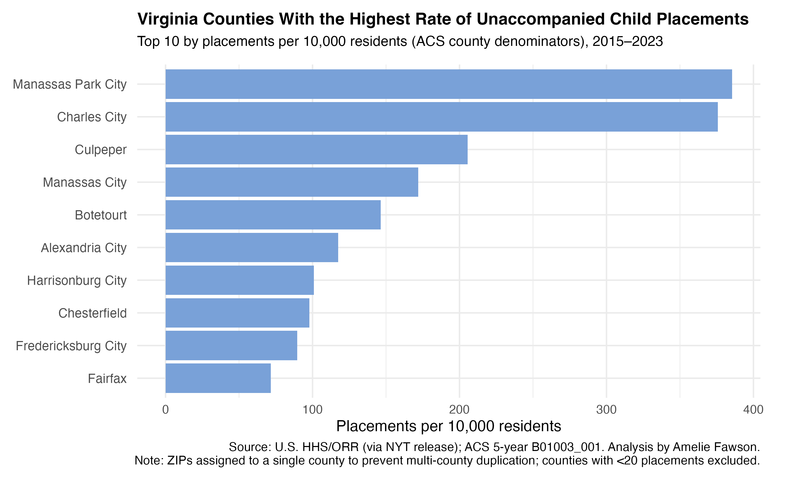

# Virginia Migrant Children — Data Analysis (R)

> Repository: `virginia-migrant-children-analysis`

## Preview




---

## What’s inside
- Clean R Markdown analysis (`.Rmd`) that produces:
  - **Top counties by rate** (per 10,000 residents)
  - **Top counties by total placements**
  - **Monthly trend line (2015–2023)**
  - **County-level choropleth** (ACS polygons + rates)
- Safe **API key** workflow using `.Renviron` + `CENSUS-setup.R`
- Sensible `.gitignore` for R projects

---

## Project structure
```
virginia-migrant-children-analysis/
├─ README.md
├─ 570-final-pitch-Fawson.Rmd                 # or your renamed Rmd
├─ CENSUS-setup.R                             # loads Census API key from env
├─ .gitignore                                 # prevents secrets/artifacts in commits
├─ data/                                      # raw inputs (not included here)
│  ├─ migrantchildren.csv
│  ├─ zips_crosswalk.xlsx
│  └─ mc_w_pop.csv (optional)
└─ outputs/ (optional)                        # charts written by ggsave()
```

---

## Setup

### 1) R packages
Install once:
```r
install.packages(c(
  "tidyverse","tidyr","lubridate","readxl","janitor","scales",
  "tidycensus","sf","ggrepel"
))
```

### 2) Census API key (required by `tidycensus`)
1. Create or edit `~/.Renviron` (user-level) and add **one line**:
   ```
   CENSUS_API_KEY=your_real_census_key_here
   ```
2. Restart R/RStudio so the environment is loaded.
3. Keep `.Renviron` **out of Git** (already covered by `.gitignore`).

### 3) Key registration at runtime
The Rmd calls:
```r
source("CENSUS-setup.R")
```
`CENSUS-setup.R` reads your key from `Sys.getenv("CENSUS_API_KEY")` and registers it for the current session.

---

## How to run
1. Place raw input files in `data/` (see **Data sources** below).
2. Open the `.Rmd` in RStudio (or VS Code with the R extension).
3. Knit to **HTML**. Charts will be saved to the working directory (or `outputs/` if you set it).

---

## Data sources
- **migrantchildren.csv (2015–2023)** — ORR unaccompanied child sponsor releases (compiled by the NYT).
- **zips_crosswalk.xlsx (2022)** — ZIP → county crosswalk to assign placements to VA counties.
- **mc_w_pop.csv (optional)** — ZIP-level population for early rate checks.
- **ACS 5-year (B01003_001, 2022)** — County population via `tidycensus::get_acs(geometry = TRUE)` for denominators and shapes.

> Geographic unit: **county**. ZIPs are normalized to a single county to avoid multi-county duplication. **Rate** = placements ÷ population × 10,000.

---

## Security & reproducibility
- **No secrets in code** (API keys loaded from environment).
- `.gitignore` excludes `.Renviron`, `.env`, R session files, and build artifacts.
- Paths are **relative** (e.g., `data/...`) for easy reproduction.

---

## Acknowledgments
- U.S. HHS/ORR releases (via NYT compilation) for placement data.
- ACS via **tidycensus** for county polygons and population.
- Project by **Amelie Fawson**.
